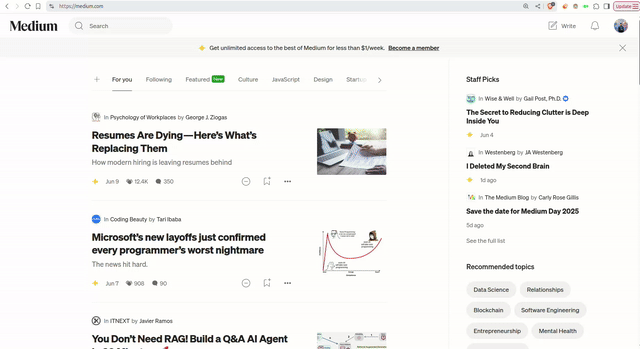
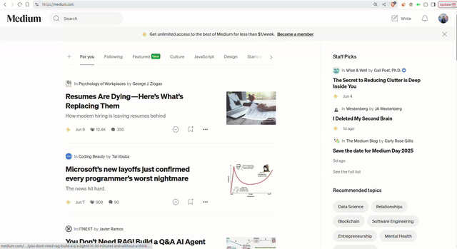

# toFreedium Browser Extension

A Chrome/Firefox browser extension that redirects Medium articles and other paywalled content to Freedium, allowing you to read articles without subscription barriers.

## Features

- **One-click redirect**: Click the extension icon to open the current page in Freedium
- **Context menu integration**: Right-click on any link or page to open it with Freedium
- **Simple and lightweight**: Fast performance

## What is Freedium?

[Freedium](https://freedium.cfd/) is a free service that bypasses paywalls on various websites, particularly Medium articles. This extension provides a convenient way to access Freedium without manually copying and pasting URLs.

## Installation

### From Source (Developer Mode)

1. Clone or download this repository
2. Open Chrome and navigate to `chrome://extensions/`
3. Enable "Developer mode" in the top-right corner
4. Click "Load unpacked" and select the extension folder
5. The extension icon should appear in your browser toolbar

### From Chrome Web Store

*Coming soon - extension will be published to the Chrome Web Store*

## Usage

### Method 1: Extension Icon
1. Navigate to any webpage (e.g., a Medium article)
2. Click the toFreedium extension icon in your browser toolbar
3. A new tab will open with the page content via Freedium



### Method 2: Context Menu
1. Right-click on any link or anywhere on a webpage
2. Select "Open with Freedium" from the context menu
3. A new tab will open with the content via Freedium



## How It Works

The extension captures the URL of the current page or clicked link, encodes it, and redirects to:
```
https://freedium.cfd/[encoded-url]
```


## Permissions

The extension requires minimal permissions:
- `tabs`: To access the current tab's URL and create new tabs
- `contextMenus`: To add the right-click context menu option


